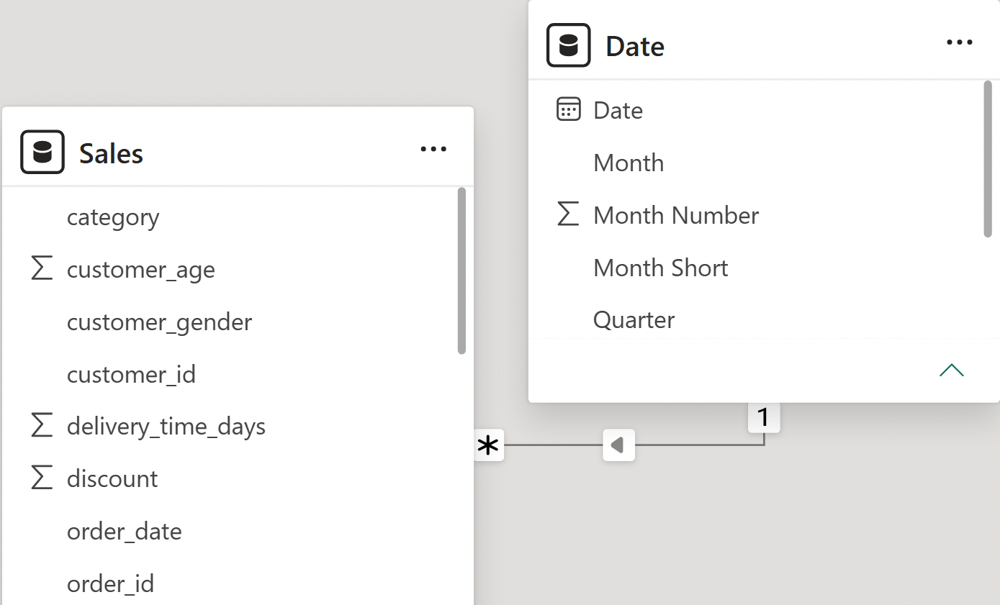
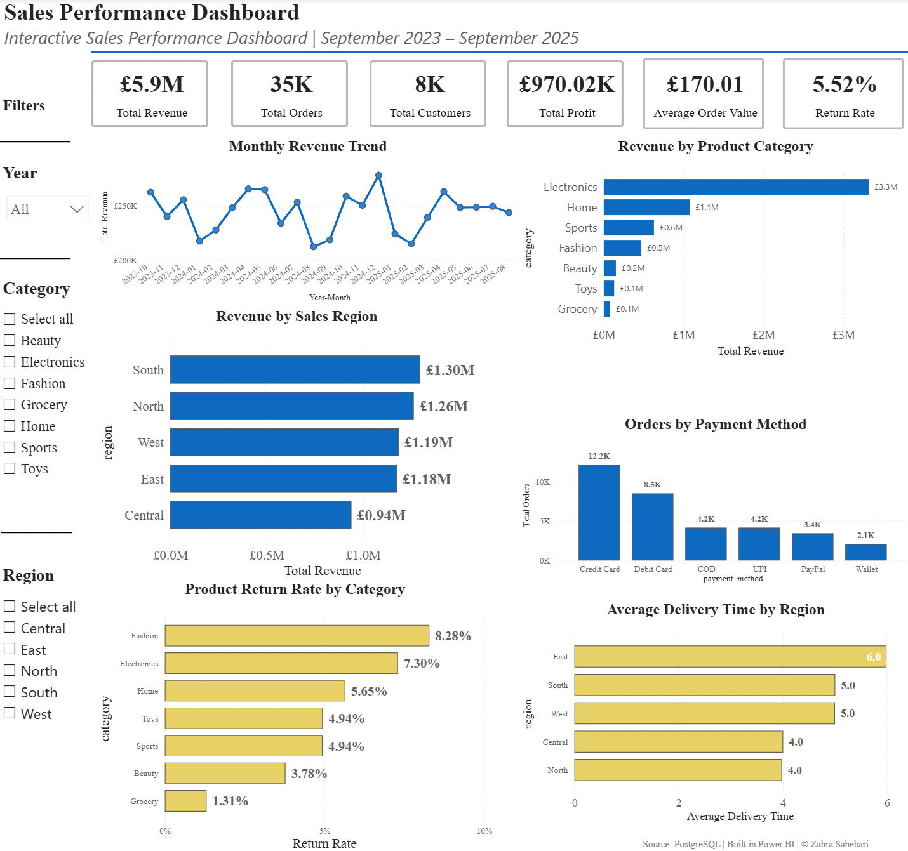

# E-commerce Sales Analysis using SQL & Power BI
**Tools:** PostgreSQL • SQL • Power BI • DAX • pgAdmin 4 • Git • GitHub

## Table of Contents

- [Executive Summary](#executive-summary)
- [Business Objectives](#business-objectives)
- [Dataset](#dataset)
- [Data Model](#data-model)
- [Data Quality Assessment](#data-quality-assessment)
- [Exploratory Data Analysis](#exploratory-data-analysis)
- [Business Questions](#business-questions)
- [Power BI Dashboard](#power-bi-dashboard)
- [Key Findings](#key-findings)
- [Business Recommendations](#business-recommendations)
- [Repository Structure](#repository-structure)

## Executive Summary

This end-to-end data analytics project analyses 34,500 e-commerce sales transactions to evaluate sales performance, customer behaviour and operational efficiency. PostgreSQL was used for data preparation, validation and business analysis, while Power BI was used to develop an interactive dashboard that enables users to monitor key performance indicators and explore business performance through interactive filtering.

## Business Objectives

The objective of this analysis is to explore transactional sales data and answer business questions that support data-driven decision-making.

The analysis focuses on:

- Evaluating revenue and profitability across product categories and regions
- Identifying customer purchasing patterns and high-value customer segments
- Assessing the impact of discounts, payment methods and delivery performance
- Analysing return behaviour and operational performance
- Identifying trends that could support commercial decision-making

## Dataset

The analysis is based on an e-commerce sales dataset containing 34,500 transactions collected between September 2023 and September 2025. Each record corresponds to a completed customer order and includes information on:

- Orders and customers
- Products and categories
- Sales revenue and discounts
- Profit margins
- Shipping costs
- Delivery times
- Payment methods
- Customer demographics
- Product returns
- Sales regions

The dataset was sourced from Kaggle, imported into PostgreSQL for data preparation and analysis, and subsequently connected to Power BI for data modelling and dashboard development.

## Data Model

The original dataset was imported into a PostgreSQL table named `sales`, where each row represents a completed customer order.

The `sales` table contains information across six business areas:

- Customer information
- Product information
- Order details
- Financial metrics
- Delivery performance
- Return status

To support interactive reporting and time-based analysis, the data was imported into Power BI and modelled using a simple star schema.

The final Power BI data model consists of:

- **Sales** – Fact table containing 34,500 transaction records.
- **Date** – Dimension table created in Power BI using DAX to enable analysis by year, quarter and month.

A one-to-many relationship was established between the `Date` and `Sales` tables using the `order_date` field, enabling accurate time intelligence, KPI calculations and consistent filter propagation across all dashboard visuals.

The SQL script used to create the `sales` table is available in `sql/00_database_setup.sql`.

### Star Schema



## Data Quality Assessment

Before conducting the analysis, a series of data quality checks were performed to ensure the dataset was suitable for analysis. The validation process included:

- Checking for duplicate records
- Identifying missing values and blank text fields
- Validating data types and value ranges
- Verifying business rules (e.g. discounts, prices and customer ages)
- Confirming calculated fields such as `total_amount`
- Reviewing overall data consistency

The dataset was found to be suitable for analysis, with no duplicate records or missing values. A small number of calculated field inconsistencies were identified and documented as part of the data quality assessment.

## Exploratory Data Analysis

An initial exploratory analysis was conducted to understand the structure and characteristics of the dataset before addressing the business questions.

The exploration included:

- Order volume over time
- Customer demographics
- Product category composition
- Regional sales distribution
- Temporal sales trends

This stage provided context for the subsequent business analysis and helped identify patterns that informed the selection of business questions.

## Business Questions

The analysis addresses a range of business questions designed to evaluate commercial performance, customer behaviour and operational efficiency.

The investigation covers:

- Revenue and profitability analysis
- Product category performance
- Regional sales performance
- Customer purchasing behaviour
- Customer segmentation
- Payment method analysis
- Discount effectiveness
- Delivery performance and product returns
- Monthly sales trends
- Customer and product rankings

## Power BI Dashboard

An interactive Power BI dashboard was developed to enable users to explore sales performance through dynamic filtering and KPI monitoring.

The dashboard includes:

- Revenue, Orders, Customers, Profit, Average Order Value and Return Rate KPIs
- Monthly Revenue Trend
- Revenue by Product Category
- Revenue by Sales Region
- Orders by Payment Method
- Product Return Rate by Category
- Average Delivery Time by Region

### Dashboard Overview



The Power BI report (`.pbix`) is available in the `powerbi` folder, while the SQL scripts used throughout the analysis are organised within the `sql` directory.

## Key Findings

- Electronics was the strongest-performing product category, generating the highest revenue, total profit and average profit per order.
- Beauty achieved the highest profit margin percentage, while Grocery was the only category operating at an overall loss.
- Revenue was relatively evenly distributed across regions, although the South generated the highest overall sales and the Central region recorded the lowest.
- Higher discount levels were associated with lower revenue, fewer orders and reduced profitability, suggesting that larger discounts did not improve overall business performance.
- Return rates increased slightly as delivery times became longer, indicating a possible relationship between delivery performance and product returns.
- Adult and Middle-aged customers segments generated the highest revenue and profit, making them the most valuable customer segments within the dataset.


## Business Recommendations

Based on the analysis, the following recommendations could help improve business performance:

- Continue investing in high-performing product categories such as Electronics while investigating the factors limiting the profitability of lower-performing categories, particularly Grocery.
- Review pricing and discount strategies to ensure promotional activities drive sustainable revenue growth without eroding profitability.
- Prioritise the Adult and Middle-aged customer segments through targeted marketing, personalised offers and customer retention initiatives.
- Investigate the factors contributing to stronger sales performance in the South region and assess opportunities to improve performance in lower-performing regions.
- Improve delivery efficiency to help minimise product returns and enhance the overall customer experience.
- Monitor category profitability alongside revenue to ensure commercial decisions are driven by both sales growth and financial performance.

These recommendations are based on the available transactional data. Incorporating additional information, such as marketing campaigns, inventory levels, customer lifetime value and product costs, would enable a more comprehensive business assessment.

## Repository Structure

```text
E-commerce-Sales-Analysis/
│
├── data/                          # Raw dataset
├── images/                        # README images
├── powerbi/                       # Power BI dashboard (.pbix)
├── sql/
│   ├── 00_database_setup.sql
│   ├── 01_data_quality_checks.sql
│   ├── 02_exploratory_analysis.sql
│   └── 03_business_questions.sql
├── README.md
├── LICENSE
└── .gitignore
```